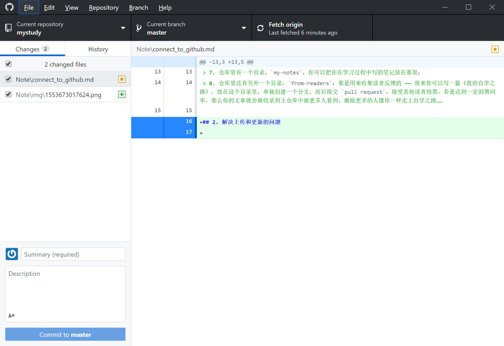

# 连接到github的方式记录

## 1.从[自学技艺](#)中获得的内容

这里所说的内容包括Jupyterlab的使用和安装部分

> 1. 注册 [github.com](https://github.com) 帐号 —— 无论如何你都必须有 github 账户；
> 2. 使用浏览器访问 [https://github.com/selfteaching/the-craft-of-selfteaching](https://github.com/selfteaching/the-craft-of-selfteaching)；
> 3. 在页面右上部找到 “Fork” 按钮，将该仓库 Fork 到你自己的账户中；
> 4. 使用 `git clone` 命令或者使用 [Desktop for Github](https://desktop.github.com/) 将 [the craft of selfteaching](https://github.com/xiaolai/the-craft-of-selfteaching) 这个你 Fork 过来的仓库克隆到本地；
> 5. 按照 [Jupyterlab 的安装与配置](T-appendix.jupyter-installation-and-setup.md) 的说明在本地搭建好 Jupyterlab —— 如果在 Jupyterlab 中浏览本书的话，其中的所有代码都是可以 “当场执行” 的，并且，你还可以直接改着玩……
> 6. 在阅读过程中，可以不断通过修改文章中的代码作为练习 —— 这样做的结果就是已阅读过的文件会发生变化…… 每读完一章，甚至时时刻刻，你都可以通过 `git commit` 命令向你自己 Fork 过来的仓库提交变化 —— 这就是你的阅读工作证明；
> 7. 仓库里有一个目录，`my-notes`，你可以把你在学习过程中写的笔记放在那里；
> 8. 仓库里还有另外一个目录，`from-readers`；那是用来收集读者反馈的 —— 将来你可以写一篇《我的自学之路》，放在这个目录里，单独创建一个分支，而后提交 `pull request`，接受其他读者投票，若是达到一定的赞同率，那么你的文章就会被收录到主仓库中被更多人看到，激励更多的人像你一样走上自学之路……

最后采用了github提供的软件.

## 2. 解决上传和更新的问题

所有更改的文件在左侧的`changes`中都会显示, 对这些内容, 填写下方面的`commit` 信息之后, 提交后确认更改.

选择`response`中的`push`命令, 将更改提交到github中.

