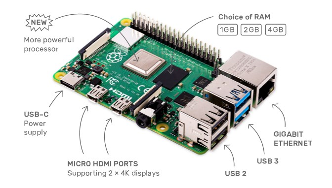

# 1.树莓派4基本情况

树莓派4 是2019年发布的最新的树莓派

 树莓派4对3代的产品做了挺大的更新, 抄书如下:

- 1.5GHz 4核心64位 ARM Cortex-A72 CPU (~3×倍性能)
- 1GB/2GB/4GB LPDDR4 SDRAM 内存
- 全吞吐量千兆以太网
- 双频 802.11ac 无线网络
- 蓝牙 5.0
- 两个 USB 3.0 和两个 USB 2.0 接口
- 双显示器支持，分辨率高达 4K
- VideoCore VI 显卡，支持 OpenGL ES 3.x
- HEVC 视频 4Kp60 硬解码
- 完全兼容早期的树莓派产品

# 2.安装

## 2.1系统

### 2.1.1 下载系统

需要8GB以上的SD卡一张, classs10以上的水平, 同时, 主编内树莓派的系统.

官方提供的系统下载地址为: [下载**Raspbian**](https://www.raspberrypi.org/downloads/)

`raspbian` 的名称是用`raspberry `和 `debian`组合而来, 本质上可以视作是一个debian系统(linux).

这个页面中还提供了一些其他的系统, 也是在树莓派上可用的, 在一些情况下是可以选用的. 其中还包括了`Ubuntu`和`Windows 10 toT Core`.

### 2.1.2 烧录系统到SD卡

利用[win32diskimager](https://sourceforge.net/projects/win32diskimager/)来烧录系统.

官方推荐的`NOOBS`还没有尝试过. 下次可以试试.

## 2.2 启动

将装好系统的SD卡插入卡槽中, 连接好显示器, 键盘, 鼠标和电源后, 就可以启动了.

> **tips**: 通电即启动, 所有电子设备都遵循开机最后接电源, 关机最先拔电源就对了

和4配合的系统已经支持中文, 并且系统比较完善了, 除了没有中文输入法, 几乎是可以当作一台linux电脑来用了.

在内存和cpu增强的情况下, 体验已经很好了.

